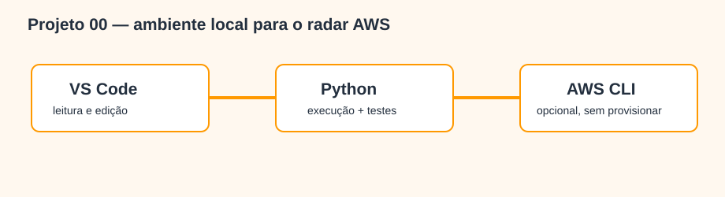

# Projeto 00 — Configuração do ambiente AWS

> Faça este projeto antes dos projetos `001` em diante. Ele prepara somente o computador e não cria recursos AWS.



## O que você aprenderá

Instalar e verificar VS Code, Python e Git; criar uma `.venv`; executar módulos e testes; entender quando a AWS CLI é necessária e por que credenciais nunca pertencem ao projeto.

## Ferramentas, bibliotecas e recursos utilizados

| Item | Obrigatório? | Função | Verificação |
|---|---:|---|---|
| VS Code | Recomendado | Editor, terminal e leitura dos diagramas | `code --version` |
| Extensão Python | Recomendado | Seleção do interpretador e testes | Extensions → Python (Microsoft) |
| Python 3.10+ | Sim | Código e testes locais | `python3 --version` |
| `venv`/`pip` | Quando houver dependências | Isolamento por projeto | `python3 -m pip --version` |
| Git | Recomendado | Revisão local; publicação exige aprovação | `git --version` |
| AWS CLI v2 | Não | Autenticação opcional em evoluções cloud | `aws --version` |
| AWS Toolkit for VS Code | Não | Exploração opcional de serviços | Extensions → AWS Toolkit |

## Passo a passo detalhado

1. Baixe o [VS Code oficial](https://code.visualstudio.com/Download), abra **Extensions** e instale `Python` da Microsoft. AWS Toolkit é opcional e não exige login para este projeto.
2. Abra **Terminal → New Terminal** e valide:

```bash
python3 --version
git --version
```

3. Abra exatamente a pasta do radar e entre no projeto 00:

```bash
cd "caminho/para/aws-data-engineering-projects"
code .
cd 000-configuracao-ambiente
```

4. Crie e ative o ambiente isolado:

```bash
python3 -m venv .venv
source .venv/bin/activate
python3 -m pip install --upgrade pip
```

5. Execute e valide:

```bash
python3 -m src.check_environment
python3 -m unittest discover -s tests -v
cat data/output/environment.json
```

`python_supported` deve ser `true`. AWS CLI pode aparecer como `null`, pois é opcional.

6. Quando um projeto futuro exigir CLI, instale apenas pela [documentação oficial](https://docs.aws.amazon.com/cli/latest/userguide/getting-started-install.html). Prefira IAM Identity Center/credenciais temporárias; nunca coloque access keys em código, JSON, `.env` versionado ou README.

## Site local com MkDocs

**MkDocs** converte Markdown em site, e **Material for MkDocs** fornece navegação, busca e cópia de código. São opcionais, gratuitos e usados apenas localmente.

```bash
cd "caminho/para/aws-data-engineering-projects"
source .venv/bin/activate
python3 -m pip install -r requirements-docs.txt
python3 -m mkdocs serve --config-file mkdocs.yml
```

Abra a URL indicada e use `Ctrl+C` para encerrar. Para gerar HTML sem publicar: `python3 -m mkdocs build --strict --config-file mkdocs.yml`. A saída fica em `site-local/AWS` e é ignorada pelo Git. Se MkDocs não for encontrado, ative a `.venv` da raiz e reinstale `requirements-docs.txt`.

## Conceitos de Engenharia de Dados aplicados

Reprodutibilidade, isolamento de dependências, local-first, credenciais temporárias e validação automatizada.

## Pré-requisitos e possíveis custos

Computador com terminal. VS Code, Python, Git e AWS CLI são gratuitos. Serviços AWS podem cobrar, mas nenhuma conta ou API é usada neste projeto.

## O que foi validado

O checker informa versões e presença das ferramentas sem ler perfis ou credenciais. Um teste garante o contrato básico.

## Pratique e registre evidência

Execute o checker, anote a versão do Python e as ferramentas encontradas; depois abra outro terminal, reative `.venv` e confirme novamente o teste `OK`.

## Solução de problemas

| Sintoma | Correção |
|---|---|
| `python3` não encontrado | Instale Python pelo site oficial e reabra o terminal |
| `code` não encontrado | Command Palette → “Shell Command: Install 'code' command” |
| `No module named src` | Volte à pasta `000-configuracao-ambiente` |
| Ambiente virtual não aparece | Execute `source .venv/bin/activate` |
| `aws` não encontrado | Continue localmente; instale somente quando necessário |
| CLI pede credenciais | Pare e consulte o projeto; não invente nem salve chaves |

## Checklist de conclusão

- [ ] Abri AWS no VS Code e selecionei o Python da `.venv`.
- [ ] Executei checker e teste com sucesso.
- [ ] Sei que AWS CLI e Toolkit são opcionais.
- [ ] Não armazenei credenciais e não criei recursos.
- [ ] Não publiquei nem executei `git push`.

## Tecnologias relacionadas ainda não utilizadas

Sem boto3, conta AWS, IAM user, access key, CloudFormation, CDK, Terraform, Docker, deploy ou CI/CD.

## Referências oficiais

- [Primeiros passos no VS Code](https://code.visualstudio.com/docs/getstarted/getting-started)
- [Python no VS Code](https://code.visualstudio.com/docs/python/python-tutorial)
- [Ambientes virtuais](https://docs.python.org/3/library/venv.html)
- [Instalar AWS CLI v2](https://docs.aws.amazon.com/cli/latest/userguide/getting-started-install.html)
- [Autenticação da AWS CLI](https://docs.aws.amazon.com/cli/latest/userguide/cli-authentication-user.html)

Rascunho local; nada foi publicado.
